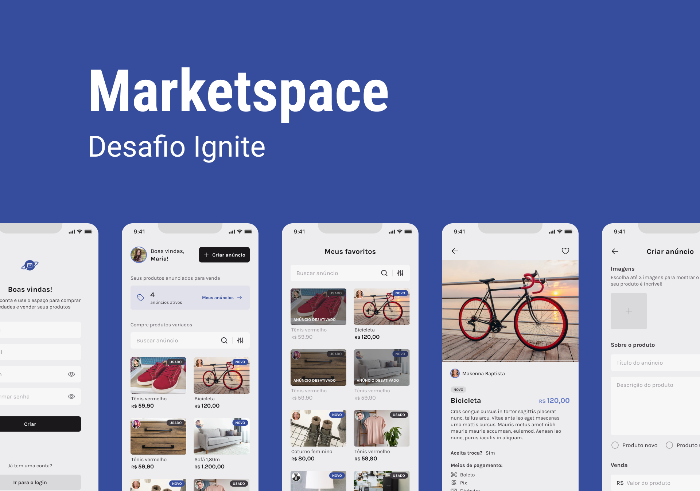

  

## 💻 Projeto

Aplicação de anúncios de produtos estilo OLX, que contém as seguintes funcionalidades:

- Login e cadastro de usuários
- Gerenciamento de produtos
- Listagem de produtos com busca e filtros
- Envio de múltiplas imagens
---

## ✨ Tecnologia

- [TypeScript](https://www.typescriptlang.org/)
- [React](https://reactjs.org/)
- [React Native](https://reactnative.dev/)
- [Expo](https://expo.dev/)
- [Axios](https://axios-http.com/docs/intro)
- [Prisma](https://www.prisma.io/)
- [Native Base - Component Library](https://nativebase.io/)
- [React Hook Form](https://react-hook-form.com/)

## 🚀 Como executar

Em todos os projetos, ao acessar a pasta, é preciso baixar os pacotes com o NPM ou YARN.

Acesse a documentação de cada projeto:

- [Backend](./server/README.md)
- [Mobile](./mobile/README.md)